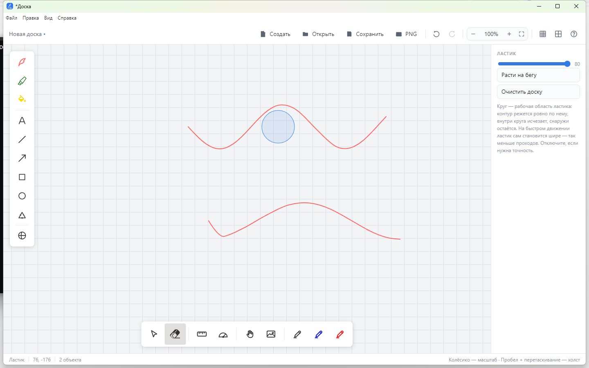

# Доска

Бесконечная электронная доска для рисования, заметок и диаграмм на Electron:
чистый JavaScript и Canvas, без фреймворков и сборщиков.



## Возможности

- **Инструменты**: перо, маркер, заливка, текст, линия, стрелка,
  прямоугольник, круг, треугольник, объёмные фигуры, выделение, рука.
- **Ластик** с круглой рабочей областью: слайдер размера 8–80, штрихи и
  контуры пустых фигур режутся по кругу касания, текст, картинки и залитые
  фигуры удаляются целиком. Режим «Расти на бегу» расширяет круг на
  быстром движении, и в одном проходе размер только растёт.
- **Заливка** со собственным цветом, независимым от цвета пера.
- **Документ**: создание, открытие, сохранение, экспорт в PNG, история
  отмены и повтора, масштаб колесом, панорамирование, сетка и клетка.
- **Приборы**: линейка и транспортир.

## Установка

Скачайте `Doka-Setup-3.0.0.exe` со страницы
[Releases](https://github.com/smold22/doka/releases) и запустите
установщик.

## Разработка

```bash
npm install   # зависимости
npm start     # запуск приложения
npm test      # 446 автотестов
npm run dist  # сборка установщика в dist/
```

## Технологии

Electron, чистый JavaScript, Canvas API.

Лицензия: MIT.
